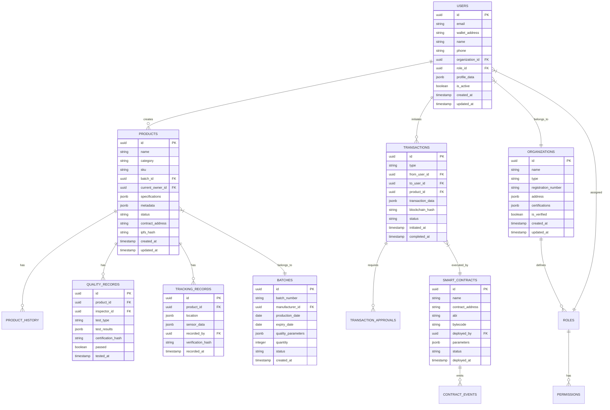

# Blockchain Supply Chain Management System - Technical Architecture Document

## 1. Architecture Design


## 2. Technology Description

* **Frontend**: React\@18 + TypeScript + Vite + TailwindCSS\@3 + Web3.js + Ethers.js

* **Backend**: Node.js\@20 + Express\@4 + TypeScript + Socket.io + Bull Queue

* **Blockchain**: Ethereum/Polygon + Solidity\@0.8.19 + Hardhat + OpenZeppelin

* **Database**: Supabase (PostgreSQL) + Redis\@7 + InfluxDB (time series)

* **Storage**: IPFS + Supabase Storage

* **Authentication**: Supabase Auth + MetaMask + WalletConnect

* **Real-time**: WebSocket + Server-Sent Events + Redis Pub/Sub

* **Monitoring**: Grafana + Prometheus + Sentry

## 3. Route Definitions

| Route         | Purpose                                                          |
| ------------- | ---------------------------------------------------------------- |
| /             | Landing page with system overview and login options              |
| /dashboard    | Main dashboard with analytics and quick actions                  |
| /login        | Authentication page with wallet connection and traditional login |
| /register     | User registration with role selection and KYC verification       |
| /products     | Product management interface with creation and tracking          |
| /products/:id | Individual product details with complete history                 |
| /inventory    | Inventory management dashboard with stock monitoring             |
| /tracking     | Real-time tracking interface with maps and IoT data              |
| /contracts    | Smart contract management and deployment interface               |
| /transactions | Transaction verification and approval workflows                  |
| /analytics    | Advanced analytics and reporting dashboard                       |
| /compliance   | Compliance monitoring and audit trail interface                  |
| /users        | User management and access control administration                |
| /settings     | System configuration and security settings                       |
| /api-docs     | API documentation and testing interface                          |

## 4. API Definitions

### 4.1 Core API

**Authentication APIs**

```
POST /api/auth/login
```

Request:

| Param Name    | Param Type | isRequired | Description                            |
| ------------- | ---------- | ---------- | -------------------------------------- |
| email         | string     | false      | Email for traditional login            |
| walletAddress | string     | false      | Wallet address for Web3 login          |
| signature     | string     | false      | Signed message for wallet verification |
| password      | string     | false      | Password for traditional login         |

Response:

| Param Name   | Param Type | Description                       |
| ------------ | ---------- | --------------------------------- |
| success      | boolean    | Authentication status             |
| token        | string     | JWT access token                  |
| refreshToken | string     | Refresh token for session renewal |
| user         | object     | User profile information          |

**Product Management APIs**

```
POST /api/products
```

Request:

| Param Name          | Param Type | isRequired | Description                     |
| ------------------- | ---------- | ---------- | ------------------------------- |
| name                | string     | true       | Product name                    |
| category            | string     | true       | Product category                |
| batchId             | string     | true       | Manufacturing batch identifier  |
| specifications      | object     | true       | Technical specifications        |
| qualityCertificates | array      | false      | Quality certification documents |
| metadata            | object     | false      | Additional product metadata     |

Response:

| Param Name      | Param Type | Description                    |
| --------------- | ---------- | ------------------------------ |
| success         | boolean    | Operation status               |
| productId       | string     | Generated product identifier   |
| transactionHash | string     | Blockchain transaction hash    |
| ipfsHash        | string     | IPFS hash for metadata storage |

**Smart Contract APIs**

```
POST /api/contracts/deploy
```

Request:

| Param Name   | Param Type | isRequired | Description                        |
| ------------ | ---------- | ---------- | ---------------------------------- |
| contractType | string     | true       | Type of contract to deploy         |
| parameters   | object     | true       | Contract initialization parameters |
| gasLimit     | number     | false      | Gas limit for deployment           |

Response:

| Param Name      | Param Type | Description                 |
| --------------- | ---------- | --------------------------- |
| success         | boolean    | Deployment status           |
| contractAddress | string     | Deployed contract address   |
| transactionHash | string     | Deployment transaction hash |

**Real-time Tracking APIs**

```
POST /api/tracking/update
```

Request:

| Param Name | Param Type | isRequired | Description                        |
| ---------- | ---------- | ---------- | ---------------------------------- |
| productId  | string     | true       | Product identifier                 |
| location   | object     | true       | GPS coordinates and address        |
| sensorData | object     | false      | IoT sensor readings                |
| timestamp  | string     | true       | Update timestamp                   |
| signature  | string     | true       | Digital signature for verification |

Response:

| Param Name   | Param Type | Description                 |
| ------------ | ---------- | --------------------------- |
| success      | boolean    | Update status               |
| trackingId   | string     | Tracking record identifier  |
| blockchainTx | string     | Blockchain transaction hash |

## 5. Server Architecture Diagram


## 6. Data Model

### 6.1 Data Model Definition



### 6.2 Data Definition Language

**Users Table**

```sql
-- Create users table
CREATE TABLE users (
    id UUID PRIMARY KEY DEFAULT gen_random_uuid(),
    email VARCHAR(255) UNIQUE,
    wallet_address VARCHAR(42) UNIQUE,
    name VARCHAR(255) NOT NULL,
    phone VARCHAR(20),
    organization_id UUID REFERENCES organizations(id),
    role_id UUID REFERENCES roles(id),
    profile_data JSONB DEFAULT '{}',
    is_active BOOLEAN DEFAULT true,
    created_at TIMESTAMP WITH TIME ZONE DEFAULT NOW(),
    updated_at TIMESTAMP WITH TIME ZONE DEFAULT NOW()
);

-- Create indexes
CREATE INDEX idx_users_email ON users(email);
CREATE INDEX idx_users_wallet ON users(wallet_address);
CREATE INDEX idx_users_organization ON users(organization_id);
CREATE INDEX idx_users_role ON users(role_id);

-- Row Level Security
ALTER TABLE users ENABLE ROW LEVEL SECURITY;

-- Policies
CREATE POLICY "Users can view own profile" ON users
    FOR SELECT USING (auth.uid() = id);

CREATE POLICY "Admins can view all users" ON users
    FOR SELECT USING (
        EXISTS (
            SELECT 1 FROM roles r 
            JOIN users u ON u.role_id = r.id 
            WHERE u.id = auth.uid() AND r.name = 'admin'
        )
    );
```

**Products Table**

```sql
-- Create products table
CREATE TABLE products (
    id UUID PRIMARY KEY DEFAULT gen_random_uuid(),
    name VARCHAR(255) NOT NULL,
    category VARCHAR(100) NOT NULL,
    sku VARCHAR(100) UNIQUE NOT NULL,
    batch_id UUID REFERENCES batches(id),
    current_owner_id UUID REFERENCES users(id),
    specifications JSONB DEFAULT '{}',
    metadata JSONB DEFAULT '{}',
    status VARCHAR(50) DEFAULT 'created',
    contract_address VARCHAR(42),
    ipfs_hash VARCHAR(100),
    created_at TIMESTAMP WITH TIME ZONE DEFAULT NOW(),
    updated_at TIMESTAMP WITH TIME ZONE DEFAULT NOW()
);

-- Create indexes
CREATE INDEX idx_products_sku ON products(sku);
CREATE INDEX idx_products_batch ON products(batch_id);
CREATE INDEX idx_products_owner ON products(current_owner_id);
CREATE INDEX idx_products_status ON products(status);
CREATE INDEX idx_products_category ON products(category);

-- Full text search
CREATE INDEX idx_products_search ON products USING gin(to_tsvector('english', name || ' ' || category));

-- Row Level Security
ALTER TABLE products ENABLE ROW LEVEL SECURITY;

-- Policies
CREATE POLICY "Users can view products in their organization" ON products
    FOR SELECT USING (
        EXISTS (
            SELECT 1 FROM users u1, users u2 
            WHERE u1.id = auth.uid() 
            AND u2.id = products.current_owner_id 
            AND u1.organization_id = u2.organization_id
        )
    );
```

**Smart Contracts Table**

```sql
-- Create smart_contracts table
CREATE TABLE smart_contracts (
    id UUID PRIMARY KEY DEFAULT gen_random_uuid(),
    name VARCHAR(255) NOT NULL,
    contract_address VARCHAR(42) UNIQUE NOT NULL,
    abi TEXT NOT NULL,
    bytecode TEXT,
    deployed_by UUID REFERENCES users(id),
    parameters JSONB DEFAULT '{}',
    status VARCHAR(50) DEFAULT 'deployed',
    deployed_at TIMESTAMP WITH TIME ZONE DEFAULT NOW()
);

-- Create indexes
CREATE INDEX idx_contracts_address ON smart_contracts(contract_address);
CREATE INDEX idx_contracts_deployer ON smart_contracts(deployed_by);
CREATE INDEX idx_contracts_status ON smart_contracts(status);

-- Row Level Security
ALTER TABLE smart_contracts ENABLE ROW LEVEL SECURITY;

-- Grant permissions
GRANT SELECT ON smart_contracts TO anon;
GRANT ALL PRIVILEGES ON smart_contracts TO authenticated;
```

**Tracking Records Table**

```sql
-- Create tracking_records table
CREATE TABLE tracking_records (
    id UUID PRIMARY KEY DEFAULT gen_random_uuid(),
    product_id UUID REFERENCES products(id) ON DELETE CASCADE,
    location JSONB NOT NULL,
    sensor_data JSONB DEFAULT '{}',
    recorded_by UUID REFERENCES users(id),
    verification_hash VARCHAR(100),
    recorded_at TIMESTAMP WITH TIME ZONE DEFAULT NOW()
);

-- Create indexes
CREATE INDEX idx_tracking_product ON tracking_records(product_id);
CREATE INDEX idx_tracking_time ON tracking_records(recorded_at DESC);
CREATE INDEX idx_tracking_recorder ON tracking_records(recorded_by);

-- Spatial index for location queries
CREATE INDEX idx_tracking_location ON tracking_records USING gin(location);

-- Row Level Security
ALTER TABLE tracking_records ENABLE ROW LEVEL SECURITY;

-- Grant permissions
GRANT SELECT ON tracking_records TO anon;
GRANT ALL PRIVILEGES ON tracking_records TO authenticated;
```

**Initial Data**

```sql
-- Insert default roles
INSERT INTO roles (name, description, permissions) VALUES
('admin', 'System Administrator', '["all"]'),
('supplier', 'Product Supplier', '["create_product", "manage_inventory"]'),
('manufacturer', 'Product Manufacturer', '["transform_product", "quality_control"]'),
('distributor', 'Product Distributor', '["transfer_product", "track_shipment"]'),
('retailer', 'Product Retailer', '["sell_product", "customer_service"]'),
('auditor', 'Quality Auditor', '["audit_quality", "verify_compliance"]'),
('consumer', 'End Consumer', '["verify_product", "view_history"]');

-- Insert sample organizations
INSERT INTO organizations (name, type, registration_number, is_verified) VALUES
('Global Supply Corp', 'supplier', 'SUP001', true),
('TechManufacturing Ltd', 'manufacturer', 'MFG001', true),
('Logistics Express', 'distributor', 'DIS001', true),
('Retail Chain Inc', 'retailer', 'RET001', true);
```

