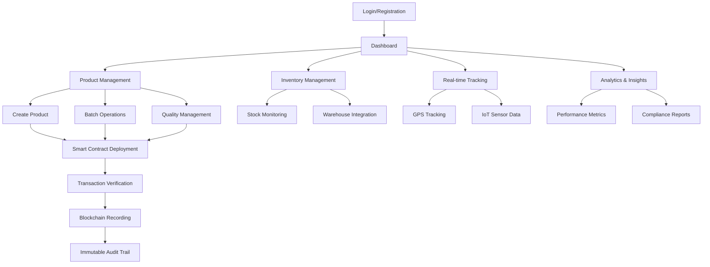

# Blockchain Supply Chain Management System - Product Requirements Document

## 1. Product Overview
A comprehensive blockchain-based supply chain management platform that enables secure, transparent, and immutable tracking of products from origin to consumer. The system leverages smart contracts for automated verification, real-time tracking capabilities, and role-based access controls to ensure data integrity and stakeholder accountability across the entire supply chain ecosystem.

The platform addresses critical supply chain challenges including lack of transparency, counterfeit products, inefficient inventory management, and compliance tracking while providing scalable infrastructure for enterprise-level operations.

## 2. Core Features

### 2.1 User Roles
| Role | Registration Method | Core Permissions |
|------|---------------------|------------------|
| System Administrator | Admin invitation with multi-factor authentication | Full system access, user management, smart contract deployment |
| Supply Chain Manager | Company registration with verification | Cross-organization visibility, analytics access, compliance reporting |
| Supplier | Business registration with KYC verification | Product creation, inventory management, quality data input |
| Manufacturer | Business registration with compliance certificates | Product transformation, batch processing, quality assurance |
| Distributor | Logistics company registration | Transportation tracking, custody transfers, location updates |
| Retailer | Retail business registration | Final sale recording, customer interaction, return processing |
| Quality Auditor | Professional certification verification | Quality inspection, compliance verification, audit trail access |
| Consumer | Email/mobile registration | Product verification, authenticity checking, history viewing |

### 2.2 Feature Module
Our enhanced blockchain supply chain system consists of the following main pages:
1. **Dashboard**: Real-time analytics, KPI monitoring, alert notifications, system health indicators
2. **Product Management**: Product creation, batch operations, lifecycle tracking, quality management
3. **Smart Contracts**: Contract deployment, template management, automated execution monitoring
4. **Inventory Management**: Stock levels, automated reordering, warehouse integration, batch tracking
5. **Transaction Verification**: Multi-signature approvals, automated validation, dispute resolution
6. **Real-time Tracking**: GPS integration, IoT sensor data, location history, delivery status
7. **Access Control**: Role management, permission settings, authentication logs, security policies
8. **Compliance & Reporting**: Regulatory compliance, audit trails, custom reports, data export
9. **Analytics & Insights**: Performance metrics, trend analysis, predictive analytics, business intelligence
10. **User Management**: Account creation, role assignment, profile management, activity monitoring

### 2.3 Page Details
| Page Name | Module Name | Feature description |
|-----------|-------------|---------------------|
| Dashboard | Analytics Overview | Display real-time KPIs, transaction volumes, system performance metrics, alert notifications |
| Dashboard | Quick Actions | Provide shortcuts for common tasks like product creation, transfer initiation, report generation |
| Dashboard | System Health | Monitor blockchain network status, smart contract execution, node connectivity |
| Product Management | Product Creation | Create products with detailed metadata, batch information, quality specifications, compliance data |
| Product Management | Batch Operations | Handle bulk product operations, mass transfers, batch quality updates, inventory adjustments |
| Product Management | Lifecycle Tracking | Track complete product journey from raw materials to end consumer with immutable records |
| Product Management | Quality Management | Record quality inspections, test results, certifications, compliance status |
| Smart Contracts | Contract Templates | Manage pre-built contract templates for common supply chain scenarios |
| Smart Contracts | Deployment Interface | Deploy new smart contracts with parameter configuration and testing capabilities |
| Smart Contracts | Execution Monitoring | Monitor contract execution, gas usage, transaction status, error handling |
| Inventory Management | Stock Monitoring | Real-time inventory levels, low stock alerts, automated reorder triggers |
| Inventory Management | Warehouse Integration | Connect with existing warehouse management systems, barcode scanning, RFID integration |
| Inventory Management | Batch Tracking | Track inventory by batches, expiration dates, quality grades, storage conditions |
| Transaction Verification | Multi-signature Setup | Configure multi-party approval workflows for high-value transactions |
| Transaction Verification | Automated Validation | Implement business rule validation, compliance checking, fraud detection |
| Transaction Verification | Dispute Resolution | Handle transaction disputes, evidence collection, arbitration processes |
| Real-time Tracking | GPS Integration | Track shipment locations, delivery routes, estimated arrival times |
| Real-time Tracking | IoT Sensor Data | Monitor temperature, humidity, shock, tamper detection during transport |
| Real-time Tracking | Location History | Maintain complete location audit trail with timestamps and verification |
| Access Control | Role Management | Define custom roles, permission matrices, hierarchical access structures |
| Access Control | Authentication | Multi-factor authentication, biometric verification, session management |
| Access Control | Security Policies | Configure password policies, access restrictions, audit requirements |
| Compliance & Reporting | Regulatory Compliance | Ensure adherence to industry standards, government regulations, certification requirements |
| Compliance & Reporting | Audit Trails | Generate comprehensive audit reports, transaction histories, compliance documentation |
| Compliance & Reporting | Custom Reports | Create tailored reports for different stakeholders, scheduled report generation |
| Analytics & Insights | Performance Metrics | Track supply chain efficiency, delivery times, quality scores, cost analysis |
| Analytics & Insights | Trend Analysis | Identify patterns in supply chain data, seasonal trends, performance improvements |
| Analytics & Insights | Predictive Analytics | Forecast demand, predict delays, identify potential quality issues |
| User Management | Account Registration | Streamlined onboarding process with KYC verification, document upload |
| User Management | Profile Management | User profile updates, company information, certification management |
| User Management | Activity Monitoring | Track user actions, login history, permission usage, security events |

## 3. Core Process

**Administrator Flow:**
System administrators manage the overall platform, deploy smart contracts, configure system parameters, and oversee user management. They monitor system health, handle escalated issues, and ensure compliance with security policies.

**Supplier Flow:**
Suppliers register products with detailed specifications, upload quality certificates, and initiate the supply chain process. They manage inventory levels, respond to quality inquiries, and maintain compliance documentation.

**Manufacturer Flow:**
Manufacturers receive raw materials, transform them into finished products, record production processes, and conduct quality assurance. They manage batch operations, update product specifications, and transfer products to distributors.

**Distributor Flow:**
Distributors receive products from manufacturers, manage warehouse operations, coordinate shipments, and track deliveries. They update location data, handle custody transfers, and ensure proper storage conditions.

**Retailer Flow:**
Retailers receive products from distributors, manage retail inventory, process customer sales, and handle returns. They provide product authenticity verification to consumers and maintain sales records.

**Quality Auditor Flow:**
Quality auditors conduct inspections at various supply chain stages, verify compliance with standards, record audit findings, and issue certifications. They investigate quality issues and maintain audit documentation.

**Consumer Flow:**
Consumers scan product codes to verify authenticity, view product history, check quality certifications, and report issues. They access transparency information and provide feedback on product quality.

## 4. User Interface Design

### 4.1 Design Style
- **Primary Colors**: Deep blue (#1e40af) for trust and security, emerald green (#059669) for success states
- **Secondary Colors**: Slate gray (#64748b) for text, amber (#f59e0b) for warnings, red (#dc2626) for errors
- **Button Style**: Rounded corners (8px radius), subtle shadows, hover animations with color transitions
- **Typography**: Inter font family, 16px base size, clear hierarchy with 14px-32px range
- **Layout Style**: Card-based design with clean spacing, top navigation with breadcrumbs, sidebar for quick access
- **Icons**: Lucide React icons with consistent 20px size, outlined style for better clarity
- **Animations**: Smooth transitions (300ms), loading states, micro-interactions for user feedback

### 4.2 Page Design Overview

| Page Name | Module Name | UI Elements |
|-----------|-------------|-------------|
| Dashboard | Analytics Cards | Grid layout with metric cards, real-time charts using Chart.js, color-coded status indicators |
| Dashboard | Quick Actions | Floating action buttons, modal dialogs for quick tasks, keyboard shortcuts |
| Product Management | Product Forms | Multi-step wizard interface, drag-drop file uploads, auto-save functionality |
| Product Management | Product Grid | Sortable table with filters, bulk selection, export options, pagination |
| Smart Contracts | Contract Editor | Code syntax highlighting, parameter validation, deployment progress indicators |
| Inventory Management | Stock Dashboard | Real-time inventory widgets, low stock alerts, interactive charts |
| Real-time Tracking | Map Interface | Interactive maps with GPS markers, route visualization, delivery status updates |
| Access Control | Permission Matrix | Role-based grid interface, toggle switches, hierarchical tree view |
| Analytics & Insights | Report Builder | Drag-drop report designer, chart customization, scheduled report setup |

### 4.3 Responsiveness
The application follows a mobile-first responsive design approach with breakpoints at 640px (mobile), 768px (tablet), and 1024px (desktop). Touch-optimized interactions include larger tap targets (44px minimum), swipe gestures for navigation, and optimized forms for mobile input. The interface adapts seamlessly across devices while